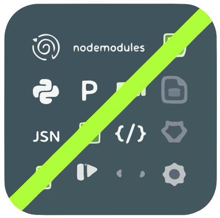

<div align="center">

</p>


# My Gitignore Boilerplate

[](https://github.com/KnowOneActual/gitignore-boilerplate/)
[](https://github.com/KnowOneActual/gitignore-boilerplate/commits/main)
[](https://github.com/KnowOneActual/gitignore-boilerplate/blob/main/LICENSE)
</div>
This repository holds a robust, general-purpose `.gitignore` file that I use as a starter for new projects. It is designed to be a "batteries-included" template for **Node.js, Python, and general web development**, while handling common files from various operating systems and editors.

## Why This Exists

Instead of starting from scratch with every new project, this boilerplate provides a solid foundation that ignores:
* **Operating System files:** `.DS_Store`, `Thumbs.db`, and other system artifacts.
* **Logs & Temp files:** Common log formats and temporary directories.
* **Editor & IDE configs:** VS Code, JetBrains (IntelliJ/PyCharm), Sublime Text, and others.
* **Node.js:** `node_modules/`, build outputs, and dependency caches.
* **Python:** `__pycache__`, virtual environments (`venv/`, `.env`), and build artifacts.

## How to Use

There are a few easy ways to grab this file for a new project.

### Option 1: Using `curl` (Recommended)

This is the quickest way. Navigate to your project's root directory in the terminal and run the following command.

```bash
curl -L -o .gitignore https://raw.githubusercontent.com/KnowOneActual/gitignore-boilerplate/main/.gitignore
````

### Option 2: Clone and Copy

You can clone this repository to your local machine and copy the file from there.

  * **First, clone the repository. This creates a new folder named "gitignore-boilerplate".**


```bash
git clone https://github.com/KnowOneActual/gitignore-boilerplate.git
```

  * **Then, copy the file from the new folder to your project's location.**


```bash
cp gitignore-boilerplate/.gitignore /path/to/your/new-project/
```

### Option 3: Manual Download

You can also just view the `.gitignore` file on GitHub, click the "Raw" button, and save the page's contents into a `.gitignore` file in your project.

## Customization

This file is a great starting point, but feel free to edit it to fit the specific needs of your project. You can add project-specific ignores at the bottom or remove sections you don't need (like the Python section if you are only working in Node).

## Refreshing the Repository

Sometimes you might add a file to `.gitignore` after it has already been committed to your repository. Git will continue to track that file even though it matches a rule in your ignore file.

To fix this, you need to remove the files from the Git index (the cache) and then re-add them.

**Be sure to commit any pending changes before running these commands.**

```bash
# 1. Remove everything from the index (your actual files are safe)
git rm -r --cached .

# 2. Re-add everything. This time, Git will respect the .gitignore rules.
git add .

# 3. Commit the "refresh"
git commit -m "Refresh .gitignore to apply new rules"
```


## License

This project is licensed under the MIT License - see the [LICENSE](https://github.com/KnowOneActual/gitignore-boilerplate/blob/bf552f7782fe2a3aa3cfc1c6dec810c0caea518f/LICENSE) file for details.
